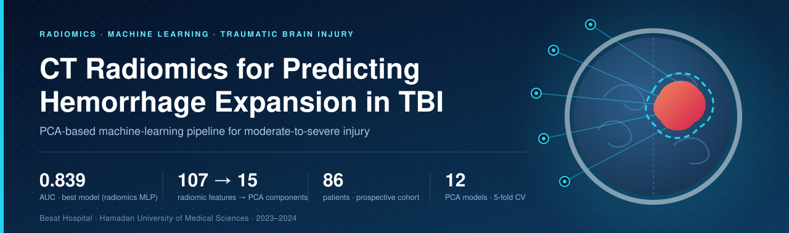
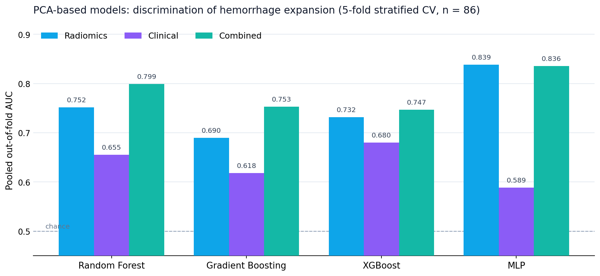
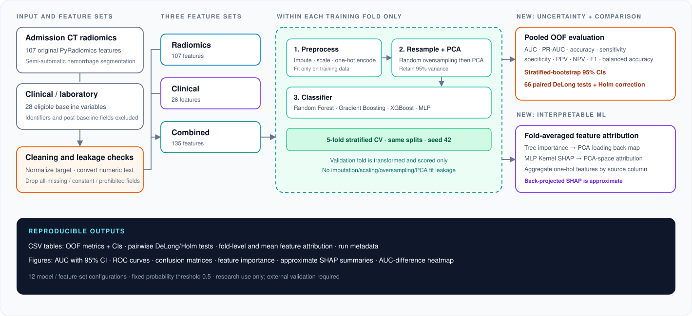

<div align="center">



<br>

[](requirements.txt)
[](tbi_pipeline/pipeline.py)
[](tbi_pipeline/pipeline.py)
[](.github/workflows/ci.yml)
[](LICENSE)
[](#citation)

**[Overview](#overview) · [Results](#results) · [Pipeline](#pipeline) · [Quick start](#quick-start) · [Data](#data-availability) · [Cite](#citation)**

</div>

---

## Overview

After moderate-to-severe traumatic brain injury (TBI), intracranial hemorrhage can keep growing during the first hours, raising intracranial pressure and the risk of surgery and death. Existing bleeding-risk scores (HAS-BLED, HEMORR<sub>2</sub>HAGES, RIETE, ATRIA) were derived in other populations, ignore imaging and reach AUCs of only about 0.57-0.64.


**Question:** do radiomic features from the admission CT predict rebleeding / hemorrhage expansion better than the clinical and laboratory data already available at admission?

**Answer in this cohort:** yes. A PCA-based radiomic multilayer perceptron reached an out-of-fold **AUC of 0.839** (accuracy 80.2%, sensitivity 82.5%, specificity 78.3%), versus an AUC of 0.670 for the best clinical model. Adding clinical variables to radiomics did not improve discrimination.

### Study at a glance

| | |
|---|---|
| **Design** | Prospective single-centre cohort, Besat Hospital, Hamadan, Iran (2023-2024) |
| **Cohort** | 147 screened → 42 excluded (missing data, age < 18, mild injury, immediate surgery) → 19 excluded (inadequate image quality) → **86 analysed** |
| **Outcome** | Rebleeding / hemorrhage expansion on follow-up CT (6 h and 24 h after the initial scan) |
| **Imaging features** | 852 PyRadiomics features from semi-automatic hemorrhage segmentation in 3D Slicer (HU 40-80, closing smoothing, manual refinement under neurosurgical supervision) |
| **Clinical features** | Age, sex, hypertension, degenerative brain disease, GCS, hemoglobin, leukocytes, platelets, PT, PTT, INR, creatinine |
| **Feature sets** | Radiomics · Clinical / laboratory · Combined |
| **Dimensionality reduction** | PCA retaining 95% of variance (mean 15.2 / 19.0 / 27.2 components) |
| **Classifiers** | Random Forest · Gradient Boosting · XGBoost · MLP |
| **Validation** | 5-fold stratified CV, pooled out-of-fold predictions → **12 PCA models** |

## Results

<div align="center">

</div>

### Out-of-fold performance of all 12 PCA models (%, AUC as 0-1)

| Feature set | Model | AUC | PR-AUC | Accuracy | Sens. | Spec. | PPV | NPV | F1 | Bal. acc. |
|---|---|:-:|:-:|:-:|:-:|:-:|:-:|:-:|:-:|:-:|
| Radiomics | Random Forest | 0.752 | 70.5 | 70.9 | 72.5 | 69.6 | 67.4 | 74.4 | 69.9 | 71.0 |
| Radiomics | Gradient Boosting | 0.690 | 65.6 | 67.4 | 75.0 | 60.9 | 62.5 | 73.7 | 68.2 | 67.9 |
| Radiomics | XGBoost | 0.732 | 70.1 | 69.8 | 67.5 | 71.7 | 67.5 | 71.7 | 67.5 | 69.6 |
| Radiomics | MLP | **0.839** | **79.2** | **80.2** | **82.5** | **78.3** | **76.7** | **83.7** | **79.5** | **80.4** |
| Clinical / lab | Random Forest | 0.631 | 55.1 | 59.3 | 55.0 | 63.0 | 56.4 | 61.7 | 55.7 | 59.0 |
| Clinical / lab | Gradient Boosting | 0.648 | 59.7 | 62.8 | 55.0 | 69.6 | 61.1 | 64.0 | 57.9 | 62.3 |
| Clinical / lab | XGBoost | 0.670 | 58.6 | 67.4 | 62.5 | 71.7 | 65.8 | 68.8 | 64.1 | 67.1 |
| Clinical / lab | MLP | 0.576 | 55.1 | 58.1 | 65.0 | 52.2 | 54.2 | 63.2 | 59.1 | 58.6 |
| Combined | Random Forest | 0.756 | 75.1 | 64.0 | 60.0 | 67.4 | 61.5 | 66.0 | 60.8 | 63.7 |
| Combined | Gradient Boosting | 0.752 | 69.7 | 64.0 | 65.0 | 63.0 | 60.5 | 67.4 | 62.7 | 64.0 |
| Combined | XGBoost | 0.751 | 77.9 | 66.3 | 65.0 | 67.4 | 63.4 | 68.9 | 64.2 | 66.2 |
| Combined | MLP | 0.777 | 74.1 | 74.4 | 72.5 | 76.1 | 72.5 | 76.1 | 72.5 | 74.3 |

*Source: [`reference_results/results_pca95.csv`](reference_results/results_pca95.csv). Bold = best model. Sens. = sensitivity, Spec. = specificity.*

**Main findings**

- **Imaging outperforms routine data.** The best radiomics model (MLP) beat the best clinical model (XGBoost, AUC 0.670, accuracy 67.4%) by about 0.17 AUC. The clinical MLP performed close to chance (AUC 0.576).
- **Radiomics carried the signal.** The Combined feature set did not improve on radiomics alone (best Combined model, MLP: AUC 0.777).
- **Tree ensembles were moderate** on radiomic and combined features (AUC 0.69-0.76).
- **Intraparenchymal hemorrhage** was the only baseline variable associated with rebleeding (chi-square P < 0.001) and was also associated with in-hospital death.

<details>
<summary><b>Univariate chi-square results</b></summary>

<br>

| Outcome | Variables with P < 0.05 |
|---|---|
| Rebleeding / hemorrhage expansion | Intraparenchymal hemorrhage (P < 0.001) |
| Need for surgery | Epidural hemorrhage (P = 0.005) · Subarachnoid hemorrhage (P = 0.045) |
| In-hospital mortality | Intraparenchymal hemorrhage (P < 0.001) · Elevated creatinine (P = 0.036) |

Degenerative brain disease also reached P = 0.045 for mortality but is present in only 2.3% of patients (sparse cells) and is treated as unstable. Tests are two-sided Pearson chi-square, unadjusted for multiple comparisons, and therefore exploratory. Full tables: [`reference_results/`](reference_results/).

</details>

> **Interpretation.** With 86 patients, a single CV partition and a single seed, differences of a few AUC points are within noise and no confidence intervals were estimated. This is internal validation only; external validation is required before any clinical use.

## Pipeline

<div align="center">

</div>

All preprocessing lives in **one `imblearn.Pipeline`** that is fitted on each training fold only:

1. **Preprocess** - median imputation and z-scoring of numeric columns; mode imputation, one-hot encoding and scaling of categorical columns.
2. **Oversample** - `RandomOverSampler` balances the classes in the training data only.
3. **PCA** - retains 95% of the variance.
4. **Classifier** - one of four models with the fixed settings below.

The validation fold is only transformed and scored, so it never influences imputation, scaling, encoding, oversampling or PCA. Predictions from the five folds are pooled and metrics are computed once (threshold 0.5).

| Model | Settings |
|---|---|
| Random Forest | 100 trees |
| Gradient Boosting | 100 estimators, learning rate 0.1, max depth 3 |
| XGBoost | 100 estimators, learning rate 0.1, max depth 3, subsample 0.8, colsample 0.8 |
| MLP | one hidden layer of 100 units, max 1000 iterations |

Random seed 42 everywhere; the five folds are identical for every model. No hyper-parameter tuning was performed.

## Quick start

```bash
git clone https://github.com/ARaclepius/tbi-hemorrhage-expansion-radiomics.git
cd tbi-hemorrhage-expansion-radiomics
python -m venv .venv && source .venv/bin/activate      # Windows: .venv\Scripts\activate
pip install -r requirements.txt
```

Try it in a minute on **synthetic data** (no patient data; metrics are meaningless):

```bash
python scripts/make_synthetic_data.py
python run_pipeline.py --data data/synthetic_example.csv --output results/demo
```

Run on the real cohort (see [Data availability](#data-availability)):

```bash
python run_pipeline.py --data data/TBI_final.csv --output results/
python run_pipeline.py --data data/TBI_final.csv --feature-sets Radiomics      # one feature set
python scripts/make_results_figure.py results/results_pca95.csv assets/auc_summary.png
```

| Output (`results/`) | Content |
|---|---|
| `results_pca95.csv` | All metrics, confusion-matrix counts and PCA components per fold (12 rows) |
| `table_radiomics.csv` · `table_clinical.csv` · `table_combined.csv` | Manuscript-style tables |
| `figures/ROC_*.png` · `figures/CM_*.png` | ROC curves per feature set; 12 confusion matrices |
| `run_metadata.json` | Seeds, library versions, dropped columns, feature-set sizes |

## Repository layout

```
run_pipeline.py            entry point
tbi_pipeline/
  config.py                seeds, CV, PCA variance, exclusion rules
  data.py                  loading, target normalisation, cleaning
  features.py              radiomics / clinical / combined split
  pipeline.py              models + leakage-safe pipeline
  evaluation.py            stratified CV, pooled out-of-fold metrics
  plots.py                 ROC curves, confusion matrices
scripts/                   synthetic data generator, results figure
reference_results/         final aggregate results (no patient data)
tests/                     pytest smoke tests (run in CI)
assets/                    README figures
data/README.md             data availability and expected schema
```

## Data availability

The de-identified dataset derives from identifiable clinical imaging and is governed by the data-protection policy of Hamadan University of Medical Sciences; it is **not included**. It is available from the corresponding author (Mahdi Arjipour) on reasonable request. The expected input format is described in [`data/README.md`](data/README.md), and the synthetic generator reproduces that schema so the code can be tested end to end. Aggregate results are in [`reference_results/`](reference_results/).

**Ethics:** approved by the Ethics Committee of Hamadan University of Medical Sciences (IR.UMSHA.REC.1403.001); informed consent was obtained; data were anonymised before analysis.

## Reproducibility

Library versions of each run are written to `results/run_metadata.json`. Small numerical differences across platforms and versions are possible (XGBoost, MLP), so compare with `reference_results/` using a small tolerance. Because the classifiers see principal components, feature-level importance is not reported. The univariate chi-square outputs are supplied as reference tables; this repository's code covers the machine-learning analysis.

## Limitations

Single-centre cohort of 86 patients with 852 radiomic features (overfitting risk despite PCA and cross-validation); internal validation only; no confidence intervals; one CV partition and seed; fixed, untuned hyper-parameters; semi-automatic, operator-dependent segmentation; CT acquisition differences can shift radiomic features. "Rebleeding" covers any new hemorrhage on follow-up imaging, including subarachnoid and intraparenchymal patterns, not only classic hematoma expansion. **This software is a research prototype, not a medical device, and must not be used for clinical decisions.**

## Citation

Please cite the paper and this repository (see [`CITATION.cff`](CITATION.cff)):


## License and contact

Developer: **Haghani , Amirreza, MD**, Faculty of Medicine, Hamadan University of Medical Sciences, Hamadan, Iran · [haghaniamirreza0@gmail.com]. Issues and pull requests are welcome.

**Acknowledgements:** the neurosurgical and radiology teams at Besat Hospital. No external funding.
