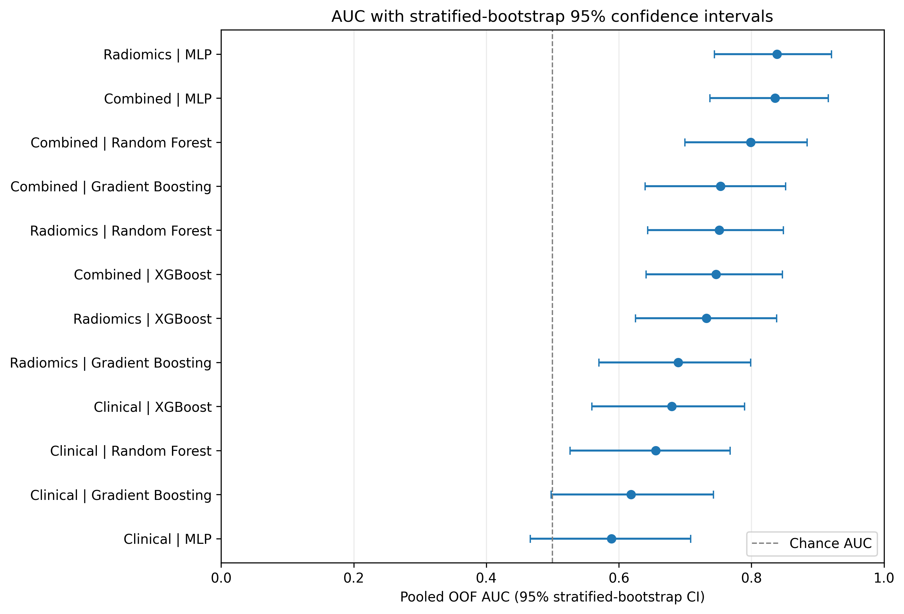
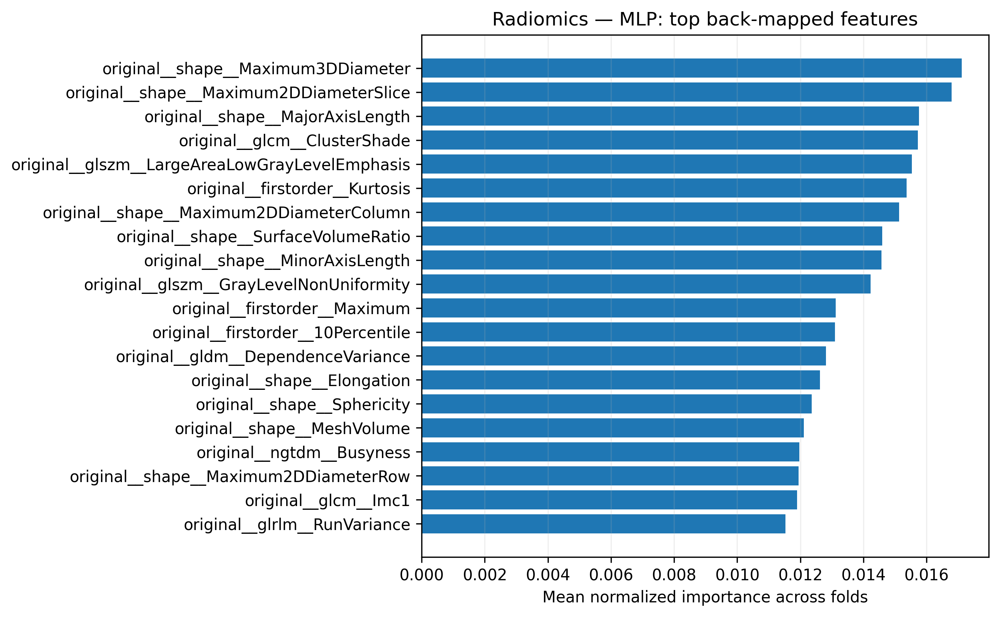
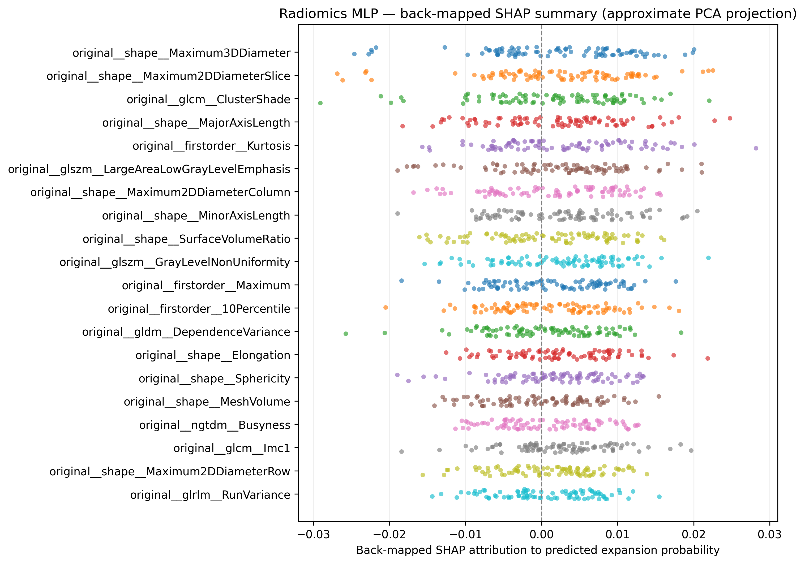

<div align="center">


<br>

[](requirements.txt)
[](.github/workflows/ci.yml)
[](tests/)
[](LICENSE)

**[Study](#study-overview) · [What’s new in v2](#whats-new-in-v20) · [Results](#results-with-95-confidence-intervals) · [Pipeline](#analysis-pipeline) · [Run it](#quick-start) · [Outputs](#outputs) · [Data](#data-availability) · [Citation](#citation)

</div>

---

## Study overview

This research project evaluates whether admission-CT radiomic features, routine clinical/laboratory variables, or their combination can predict rebleeding / hemorrhage expansion after moderate-to-severe traumatic brain injury (TBI). It compares three feature sets—**Radiomics**, **Clinical**, and **Combined**—with four classifiers: Random Forest, Gradient Boosting, XGBoost, and a multilayer perceptron (MLP).

The cohort used for the supplied reference run included **86 patients** (46 without expansion and 40 with expansion), with **107 radiomic features** and **28 clinical/laboratory features**. The patient-level CSV is not included because of privacy and ethics restrictions; see [Data availability](#data-availability).

## What’s new in v2.0

> The main update is a more complete and auditable evaluation workflow—not just a performance table. The new run reports uncertainty, formal paired model comparisons, and fold-wise feature-attribution outputs alongside the previous PCA-based modelling.

| Area | New or expanded capability |
|---|---|
| **Uncertainty estimates** | Stratified percentile-bootstrap **95% confidence intervals** for AUC, PR-AUC / average precision, accuracy, sensitivity, specificity, PPV, NPV, F1, and balanced accuracy, calculated from pooled out-of-fold (OOF) predictions. |
| **Model comparison** | Paired **DeLong AUC tests** for all 66 pairwise comparisons among the 12 model/feature-set configurations, with Holm multiple-testing correction globally and for focused comparison families. |
| **Interpretable ML** | Fold-wise source-feature importance for Random Forest, Gradient Boosting, and XGBoost, mapped from PCA-component importance back to original columns and averaged across folds. |
| **MLP explanations** | Kernel SHAP is computed in each held-out fold’s PCA space using a background sampled from that fold’s training data; attributions are also saved in PCA space and approximately back-projected to original features. |
| **Reproducibility** | Run metadata records class counts, excluded columns, detected feature-set sizes, PCA component counts, seeds, dependency versions, bootstrap settings, and the attribution method/caveats. |
| **Automated checks** | GitHub Actions installs dependencies, runs unit tests, executes an end-to-end synthetic-data smoke run, and checks that key results files were created. |
| **Colab + CLI** | Retains the supplied one-cell Colab notebook and adds a command-line entry point (`run_pipeline.py`) for local use and continuous integration. |

**Important interpretability caveat:** tree importances originate in PCA space. Mapping them to original features using absolute PCA loadings is an allocation-based approximation, not a direct raw-feature importance calculation. The MLP SHAP values are also computed in PCA space; their back-projection is explicitly **approximate and is not exact SHAP for the original raw features**. Do not present those values as exact native-feature SHAP explanations.

## Results with 95% confidence intervals

The table below comes from the supplied run on the 86-patient cohort (`reference_results/ci_interpretability/results_pca95_with_bootstrap_ci.csv`). AUC is shown as a point estimate with its **stratified-bootstrap 95% CI**. Confidence intervals describe resampling uncertainty conditional on the pooled OOF predictions; they do not replace external validation.

<div align="center">

</div>

| Feature set | Model | OOF AUC (95% CI) |
|---|---|---:|
| Radiomics | Random Forest | 0.752 (0.644–0.848) |
| Radiomics | Gradient Boosting | 0.690 (0.570–0.799) |
| Radiomics | XGBoost | 0.732 (0.625–0.838) |
| **Radiomics** | **MLP** | **0.839 (0.744–0.921)** |
| Clinical | Random Forest | 0.655 (0.526–0.768) |
| Clinical | Gradient Boosting | 0.618 (0.498–0.743) |
| Clinical | XGBoost | 0.680 (0.559–0.790) |
| Clinical | MLP | 0.589 (0.466–0.708) |
| Combined | Random Forest | 0.799 (0.699–0.884) |
| Combined | Gradient Boosting | 0.753 (0.640–0.852) |
| Combined | XGBoost | 0.747 (0.641–0.847) |
| Combined | MLP | 0.836 (0.737–0.916) |

### Interpretation of the supplied results

- The **Radiomics MLP** had the highest AUC point estimate: **0.839 (95% CI 0.744–0.921)**.
- The best Clinical model by AUC was **XGBoost: 0.680 (0.559–0.790)**.
- The Combined MLP was similar to Radiomics MLP in point estimate: **0.836 (0.737–0.916)**. The intervals are broad and overlap, so these point estimates alone do not establish that one model is statistically superior.
- The DeLong CSVs provide paired AUC differences, unadjusted p-values, and Holm-adjusted p-values. Interpret these tests as exploratory: the standard DeLong test is applied to pooled OOF predictions, and cross-validation training sets overlap.

Fold-averaged interpretability output is illustrated below. The MLP figure is a summary of **back-projected approximate** SHAP attributions, not exact raw-feature SHAP.

<div align="center">

</div>

<div align="center">

</div>

The associated aggregate tables and figures are retained in [`reference_results/ci_interpretability/`](reference_results/ci_interpretability/). Per-patient OOF predictions and case-level SHAP records are intentionally **not** bundled in the reference outputs.

## Analysis pipeline

<div align="center">

</div>

For every feature set and classifier, the workflow uses five-fold stratified cross-validation with the same patient splits and seed. All learned preprocessing occurs on training folds only:

1. **Clean the cohort.** Identify the `rebleeding` target (case-insensitive), normalize binary labels, remove rows with missing target, drop identifiers and post-baseline/leakage-prone columns, remove all-missing/constant columns, and convert string columns that are at least 80% numeric.
2. **Build three feature sets.** Detect radiomic columns using the naming rules in the code; all other eligible baseline variables are assigned to Clinical. Combined contains all eligible columns.
3. **Fit within each training fold.** Median imputation and standardization for numeric columns; most-frequent imputation, one-hot encoding and standardization for categorical columns; random oversampling; PCA retaining 95% variance; then one of the four classifiers. The validation fold is transformed and scored, never used to fit those steps.
4. **Pool out-of-fold predictions.** Each patient receives one held-out prediction per model/feature-set configuration. Point metrics use a fixed probability threshold of 0.5 for threshold-dependent metrics.
5. **Quantify uncertainty.** Resample positive and negative cases separately, preserving their original class counts, and calculate percentile 95% intervals for the nine reported metrics.
6. **Compare configurations.** Run paired DeLong AUC comparisons for the 12 configurations (66 pairs) and apply Holm adjustment for multiple testing.
7. **Interpret the models.** Estimate feature importance on fold-fitted models. For MLP, run Kernel SHAP in PCA space using only training-fold background cases, then save both PCA-space values and a clearly labelled approximate back-projection to original feature columns.

### Model settings

| Model | Fixed settings |
|---|---|
| Random Forest | 100 trees |
| Gradient Boosting | 100 estimators, learning rate 0.1, max depth 3 |
| XGBoost | 100 estimators, learning rate 0.1, max depth 3, subsample 0.8, column subsampling 0.8 |
| MLP | One hidden layer with 100 units, maximum 1,000 iterations |

Random state is 42 by default; PCA retains 95% of variance; the default bootstrap uses 2,000 replicates; Kernel SHAP defaults to a 10-case training-fold background and 100 samples per explained case. These settings can be changed from the CLI.

## Quick start

### 1. Install

```bash
git clone https://github.com/ARaclepius/tbi-hemorrhage-expansion-radiomics.git
cd tbi-hemorrhage-expansion-radiomics
python -m venv .venv
# macOS / Linux
source .venv/bin/activate
# Windows PowerShell: .venv\Scripts\Activate.ps1
python -m pip install --upgrade pip
pip install -r requirements.txt
```

### 2. Run the full pipeline on the approved patient dataset

Place the authorized cohort CSV somewhere local; it is not distributed with this repository. The file must contain a `rebleeding` target column and the expected baseline radiomic/clinical columns.

```bash
python run_pipeline.py \
  --data /path/to/TBI_final_corrected.csv \
  --output results/full_run
```

This runs all 12 PCA models, 2,000 bootstrap replicates per configuration, paired DeLong comparisons, fold-averaged feature importance, and MLP Kernel SHAP. Full SHAP attribution can take materially longer than the performance evaluation.

### 3. Quick smoke test with synthetic data

Synthetic data contains no real patient information. Its performance metrics have **no clinical meaning**.

```bash
python scripts/make_synthetic_data.py --out data/synthetic_example.csv
python run_pipeline.py \
  --data data/synthetic_example.csv \
  --output results/demo \
  --bootstrap 100 \
  --skip-shap
```

`--skip-shap` skips the MLP SHAP/refit phase for a faster demo; it still runs the 12-model CV evaluation, bootstrap intervals, DeLong comparisons, and tree-based source-feature importance. Omit `--skip-shap` for the complete interpretability workflow.

### Command-line options

| Option | Default | Purpose |
|---|---:|---|
| `--data` | `data/TBI_final_corrected.csv` | Input cohort CSV |
| `--output` | `results` | Output directory |
| `--random-state` | `42` | Reproducibility seed |
| `--n-splits` | `5` | Stratified CV folds (at least 2) |
| `--pca-variance` | `0.95` | PCA variance retained (strictly between 0 and 1) |
| `--bootstrap` | `2000` | Stratified bootstrap replicates |
| `--shap-nsamples` | `100` | Kernel SHAP approximation budget per explained case |
| `--shap-background-size` | `10` | Training-fold cases in the SHAP background |
| `--top-n-features` | `20` | Number of features in importance plots |
| `--skip-shap` | off | Skip MLP SHAP for quicker smoke tests |

Run `python run_pipeline.py --help` for the full command-line help.

### Google Colab

The original one-cell notebook was retained at [`notebooks/TBI_colab_one_cell_pipeline.ipynb`](notebooks/TBI_colab_one_cell_pipeline.ipynb). Open it in Colab, provide the authorized CSV (default notebook path: `/content/TBI_final_corrected.csv`), and run its single code cell. The notebook installs missing/old dependencies and can prompt for a CSV upload if it is not found.

## Outputs

A full run writes the following to the chosen `--output` directory:

| File | Purpose |
|---|---|
| `results_pca95_with_bootstrap_ci.csv` | Twelve model/feature-set rows with metrics, 95% CI bounds, confusion-matrix counts, and PCA components per fold |
| `metric_bootstrap_cis_long.csv` | Long-form metric/CI table for plotting or further analysis |
| `table_radiomics_with_95CI.csv`, `table_clinical_with_95CI.csv`, `table_combined_with_95CI.csv` | Manuscript-style metrics with bootstrap intervals |
| `pooled_oof_predictions.csv` | Per-case held-out probabilities and labels; keep local in the approved environment and do not commit if restricted |
| `delong_pairwise_all_models.csv` | All 66 DeLong comparisons and global/focused Holm-adjusted p-values |
| `delong_comparisons_within_feature_set.csv` | Classifier comparisons within each feature set |
| `delong_comparisons_between_feature_sets.csv` | Feature-set comparisons within each classifier |
| `delong_auc_difference_matrix.csv` | Matrix of AUC differences |
| `backmapped_feature_importance_by_fold.csv` | Fold-level feature attributions / importances |
| `backmapped_feature_importance_mean_across_folds.csv` | Fold-averaged source-feature importance with variability columns |
| `mlp_shap_pca_space_oof_attributions.csv` | MLP Kernel SHAP values in the PCA component space |
| `mlp_shap_backmapped_oof_attributions.csv` | Approximate back-projected MLP SHAP values; not exact raw-feature SHAP |
| `run_metadata.json` | Settings, versions, cleaning decisions, CV/PCA details and interpretation caveats |
| `figures/` | AUC/CI summary, ROC curves, confusion matrices, feature-importance plots, SHAP summaries and DeLong heatmap |

Per-case outputs may contain sensitive derived health information. They are excluded from the committed reference output directory and are ignored by Git patterns where appropriate. Follow your institution's data governance rules before moving or sharing generated results.

## Continuous integration

GitHub Actions runs on pushes and pull requests. It installs requirements, runs the unit tests (including tests for bootstrap intervals, DeLong calculations, Holm correction and PCA-loading normalization), generates synthetic data, then runs the full 12-configuration smoke workflow with `--skip-shap` and verifies the expected aggregate artifacts. The expensive MLP Kernel SHAP pass is tested at helper level and is run in full when the pipeline is executed without `--skip-shap`.

Workflow definition: [`.github/workflows/ci.yml`](.github/workflows/ci.yml).

## Data availability

The cohort CSV (`TBI_final_corrected.csv` or a compatible file) contains patient-level information and is **not distributed**. Use data only with the required institutional approvals and access controls. See [`data/README.md`](data/README.md) for column expectations and cleaning rules.

The pipeline excludes patient identifiers, timestamps, surgery/outcome/mortality/ICU-stay variables, and control-CT/follow-up fields to reduce identity and target leakage risk. Review the exclusion rules in the source before adapting the code to a different dataset. Automatic cleaning does not substitute for clinical/data-governance review.

## Limitations and intended use

This is an internal cross-validation analysis of a small, single-centre cohort. The percentile bootstrap holds the OOF prediction pairs fixed and therefore does not capture all sources of model-training uncertainty. DeLong p-values are approximate in this cross-validation setting because fitted models across folds share overlapping training data. Model tuning was not performed, and the attribution back-projection method is approximate. Independent external validation, prospective evaluation, and methodological review are needed before any clinical interpretation or use.

**This repository is a research prototype, not a medical device. It must not be used to make clinical decisions.**

## Citation

Please cite the relevant manuscript and repository. Repository citation metadata is in [`CITATION.cff`](CITATION.cff). When publishing this updated code version, create/update the archived software release record so the DOI points to the exact version used.

## License and contact

MIT License; see [`LICENSE`](LICENSE). Issues and pull requests are welcome. Project maintainer/contact details are listed in [`CITATION.cff`](CITATION.cff) and the repository's existing project metadata.
